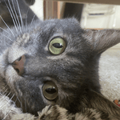

# Cat Weight and Litter Box Usage Analysis





This repository contains a Quarto notebook (`cat_analysis.qmd`) that analyzes weight trends and litter box usage patterns for my four cats over a one-month period (November 5th - December 2nd, 2024).  The data was collected from a Litter-Robot 4 automatic litter box.

In addition to Quarto, there is a helper Python script (`cleaner.py`) to clean the data. When running the analysis, the notebook will call this script automatically.

## How to View the Report

You can view the [pre-rendered report](https://mmorache.github.io/vet_analysis/) directly in your web browser.

## How to Run the Analysis

If you want to run the analysis yourself or modify the code, follow these steps:

1. **Clone the repository:**
   ```bash
   git clone https://github.com/mmorache/vet_analysis.git

1. **Install dependencies:**
    ```bash
    python3 -m venv .venv  # Create a virtual environment (recommended)
    source .venv/bin/activate  # Activate the virtual environment
    pip install -r requirements.txt  # Install required Python packages

1. **Render the notebook:**
    ```bash
    quarto render cat_analysis.qmd

